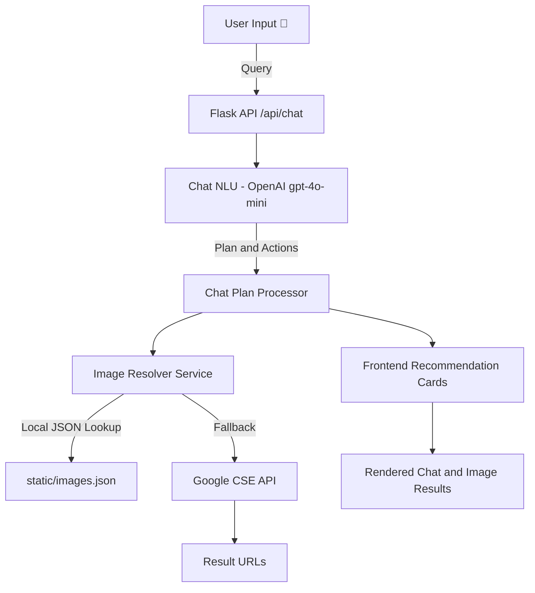
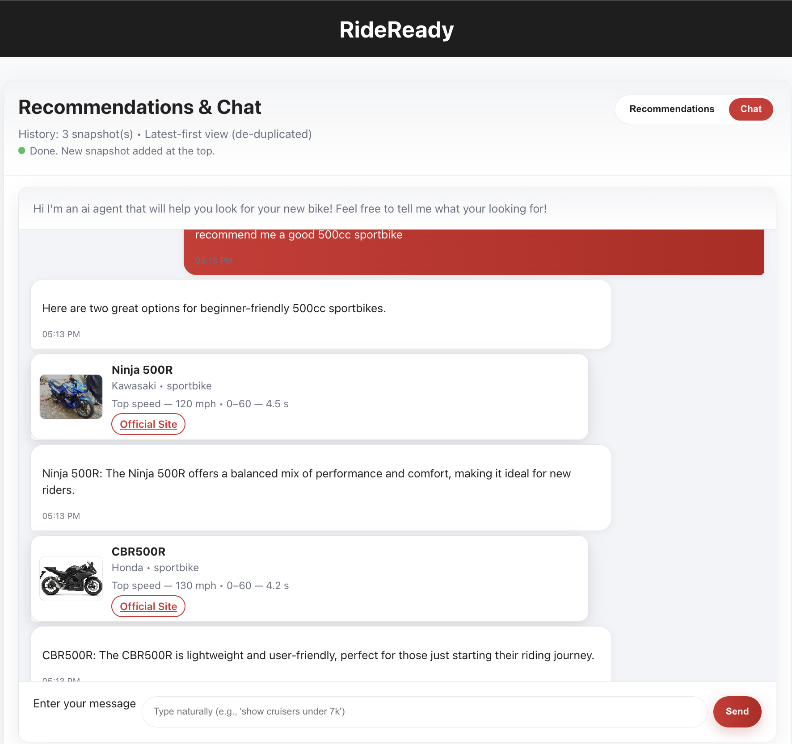

# 🏍️ RideReady — AI-Powered Motorcycle Recommender

> **Your personal riding assistant.**  
> RideReady helps new and casual riders discover motorcycles tailored to their needs through natural conversation — powered by **Flask**, **OpenAI GPT**, and **Google Image Search API**.  


---

## 👤 Author

**Hien Tran**  
*Computer Science @ California State University, Fullerton*  
💼 [LinkedIn](https://www.linkedin.com/in/hien-tran-3b4935297/)
## 🌟 Features
---
- 💬 **AI Chat Interface** — Talk naturally about your riding style, budget, and preferences.
- 🧠 **Intelligent Recommendations** — Uses OpenAI GPT to suggest beginner-friendly motorcycles.
- 🏍️ **Local-first Image Resolver** — Tries curated local images, then falls back to Google for unmatched models.
- ⚙️ **Dockerized for Production** — Served via Gunicorn and containerized for scalability.
- 🔒 **.env-driven** — Secure API key and environment variable management.
- 🧩 **Modular Services** — Clean separation for chat (NLU), images, and recommendation logic.
- 🧱 **Continuous Integration (CI)** — GitHub Actions automatically builds and publishes the Docker image to GitHub Container Registry (GHCR) on every push.

---

## 🏗️ Architecture Overview



---

## 🧰 Tech Stack

| Layer | Technology | Purpose |
|------|------------|---------|
| Backend | **Flask** | REST API & routing |
| Templates | **Jinja2** (via Flask) | Server-rendered pages / partials |
| AI Logic | **OpenAI GPT-4o-mini** | Natural-language reasoning & planning |
| Image Search | **Google Programmable Search API** | Dynamic image retrieval (fallback) |
| Frontend | **HTML + JavaScript (vanilla)** | Chat + recommendation UI |
| Containerization | **Docker** + **Gunicorn** | Production serving & concurrency |
| CI | **GitHub Actions** | Automated build + Docker publish to GHCR |
| Logging | **Flask logger** | Clean runtime logs |

---

## ⚙️ Setup
Create a `.env` file:

```bash
OPENAI_API_KEY = your_openai_key
RR_OPENAI_ENABLED=true

GOOGLE_API_KEY = your_google_api_key
GOOGLE_CSE_ID = your_cse_id
USE_GOOGLE_IMAGES=true
```

### 1) Local Development

```bash
git clone https://github.com/htran174/rideready.git
cd rideready
python -m venv .venv
source .venv/bin/activate
pip install -r requirements.txt
```
Move your .env inside your project folder

Run locally:
```bash
python app.py
# App defaults to http://localhost:5000 (Repo maps 5001:5000 in Docker)
```

---

### 2) Docker

Build the image:

```bash
# Pull the latest pre-built image from GitHub Container Registry
docker pull ghcr.io/htran174/rideready:latest
```

Run the container (map host 5001 → container 5000):

```bash
# Run it after you create an .env file
docker run --rm -p 5001:5000 --env-file .env ghcr.io/htran174/rideready:latest
```

---

## 💬 Example Query Flow



---

## 📁 Project Structure

```
RideReady/
├── app.py
├── data/
├── templates/
├── services/
│   ├── chat_nlu.py
│   ├── images.py
│   ├── images_google.py
│   ├── recommend_rules.py
├── static/
│   ├── images.json
│   └── stock_images/
│   └── js/
├── .github/workflows/ci.yml
├── Dockerfile
├── requirements.txt
└── README.md
```

---

## 🚀 Future Improvements

- 🪄 **Add Gear Recommendations** (helmets, jackets, gloves) using AI reasoning.  
- 💾 **Chat Persistence** via SQLite or Flask sessions.  
- ⚡ **Async Image Caching** for Google API calls.  
- 🧩 **Frontend Polish** (animations, message bubbles).  
- 🔁 **Continuous Deployment (CD)** — Deploy container automatically to a hosting service (i.e AWS).  
